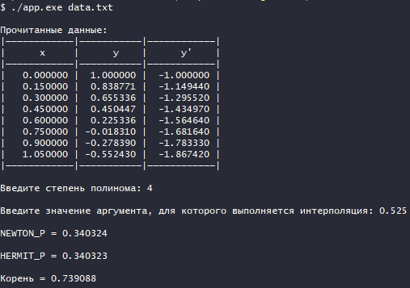
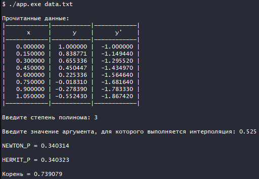
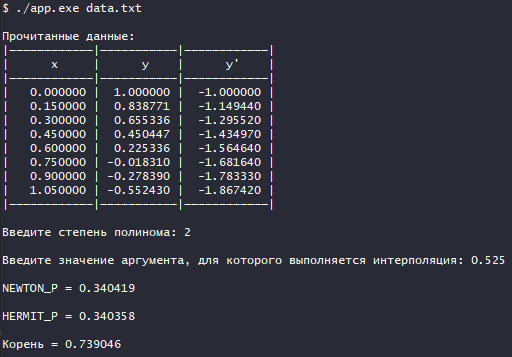
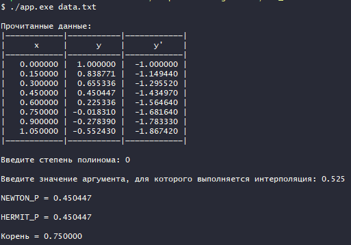

## Цель работы

Получение навыков построения алгоритма интерполяции таблично заданных функций полиномами Ньютона и Эрмита.

## Исходные данные
* Таблица функции и ее производные
  
  | x    | y         | y'        |
  | ---- | --------- | --------- |
  | 0.00 | 1.000000  | -1.000000 |
  | 0.15 | 0.838771  | -1.14944  |
  | 0.30 | 0.655336  | -1.29552  |
  | 0.45 | 0.450447  | -1.43497  |
  | 0.60 | 0.225336  | -1.56464  |
  | 0.75 | -0.018310 | -1.68164  |
  | 0.90 | -0.278390 | -1.78333  |
  | 1.05 | -0.552430 | -1.86742  |

* Степень аппроксимирующего полинома - n
* Значение аргумента, для которого выполняется интерполяция.

## Описание алгоритма

### Алгоритм построения полинома Ньютона

1. При заданных n и х строится конфигурация из n + 1 узлов, примыкающих к х.
2. Строится таблица разделенных разностей.
3. С помощью верхней строки таблицы разделенных разностей строится
полином Ньютона.

### Алгоритм построения полинома Эрмитта

1. При заданных n и х строится конфигурация из n + 1 узлов, примыкающих к х. Кратность узлов не больше двух (в конфигурации появляется узел кратности 1 при четном n).
2. Строится таблица разделенных разностей. При этом y(x0, x0) = y0'.
3. С помощью верхней строки таблицы разделенных разностей строится
полином Эрмита.

### Алгоритм нахождения корня методом обратной интерполяции

1. Проверяется наличие корня у функции.
2. В исходной таблице меняются местами столбцы x и y.
3. Выполняется построение полинома Ньютона при заданном аргументе, равным нулю. (см.  алгоритм построения полинома Ньютона)

## Код программы

```c
#define __USE_MINGW_ANSI_STDIO 1

#include <stdlib.h>
#include <stdio.h>

#define N 8
#define MAX_N 6

#define SUCCESS 0
#define INPUT_ERROR -1
#define MEMORY_ERROR -2
#define ARGV_ERROR -3
#define OPEN_FILE_ERROR -4
#define INVALID_N -5
#define INVALID_ARG -6
#define NO_ANSWER -7

// Исходные данные
typedef struct
{
    double x; // Аргумент
    double y; // Значение
    double d; // Производная
} table_t;

// Вывод сообщений об ошибках
void print_error(int err)
{
    if (err == INPUT_ERROR)
        printf("Ошибка ввода");
    else if (err == MEMORY_ERROR)
        printf("Ошибка выделения памяти");
    else if (err == ARGV_ERROR)
        printf("Ошибка при вводе аргументов командной строки");
    else if (err == OPEN_FILE_ERROR)
        printf("Ошибка открытия файла");
    else if (err == INVALID_N)
        printf("Некорректная степень полинома (0 <= n < %d)", MAX_N);
    else if (err == INVALID_ARG)
        printf("Некорректное значение аргумента для выполнения интерполяции");
    else if (err == NO_ANSWER)
        printf("Нет корня");
}

// Вывод таблицы исходных данных
void output_data(table_t table[])
{
    printf("\n|————————————|———————————|————————————|\n");
    printf("|      x     |      y    |      y'    |\n");
    printf("|————————————|———————————|————————————|\n");
    for (size_t i = 0; i < N; i++)
        printf("| %10lf | %9lf | %10lf |\n", table[i].x, table[i].y, table[i].d);
    printf("|————————————|———————————|————————————|\n");
}

// Ввод данных
int input_data(FILE *f, table_t table[])
{
    for (size_t i = 0; i < N; i++)
    {
        if (fscanf(f, "%lf", &table[i].x) != 1)
            return INPUT_ERROR;
        if (fscanf(f, "%lf", &table[i].y) != 1)
            return INPUT_ERROR;
        if (fscanf(f, "%lf", &table[i].d) != 1)
            return INPUT_ERROR;
    }

    return SUCCESS;
}

// Вывод матрицы
void output_mtx(double a[MAX_N][MAX_N], int n, int m)
{
    for (int i = 0; i < n; i++)
    {
        for (int j = 0; j < m - i; j++)
            printf("%lf ", a[i][j]);
        printf("\n");
    }
}

// Функция сравнения двух точек по их аргументу
int point_compare(const void *q, const void *p)
{
    const table_t *a = q;
    const table_t *b = p;
    return a->x - b->x;
}

// Построение полинома Эрмитта
int hermit_p(table_t table[], int table_len, double arg, int n, double *ans)
{
    double res[MAX_N][MAX_N]; // Для вычисления разделенных разностей
    int err = EXIT_SUCCESS;
    int i = 0;

    for (i = 0; arg > table[i].x && i < table_len; i++)
        ;

    // Проверка, может ли быть построен Полином Эрмитта
    if (i < (n + 1) / 4 || i > (table_len - (n + 1) / 4))
        err = INVALID_ARG;
    if (err)
        return err;

    // Выбор узлов, на которых будет строиться таблица разделенных разностей
    int start_i = i - (n + 1) / 4 - 1;
    int end_i = i + (n + 1) / 4 - 1;

    if ((n + 1) % 2 == 0)
        start_i += 1;
    if (start_i < 0)
    {
        end_i += 1;
        start_i += 1;
    }

    // Построение таблицы разделенных разностей
    // Заполнение первого столбца x
    int k = start_i;
    for (int res_i = 0; res_i <= n; res_i++)
    {
        res[res_i][0] = table[k].x;
        if (res_i < n)
            res[++res_i][0] = table[k++].x;
    }

    // Заполнение второго столбца
    k = start_i;
    for (int res_i = 0; res_i < n; res_i++)
    {
        if (res[res_i][0] == res[res_i + 1][0])
            res[res_i][1] = table[k++].d;
        else
            res[res_i][1] = (table[k - 1].y - table[k].y) / (table[k - 1].x - table[k].x);
    }

    // Заполнение остальных столбцов таблицы
    for (int j = 2; j < n + 1; j++)
    {
        for (int res_i = 0; res_i < n - j + 1; res_i++)
            res[res_i][j] = (res[res_i][j - 1] - res[res_i + 1][j - 1]) / (res[res_i][0] - res[res_i + j][0]);
    }

    //output_mtx(res, MAX_N, MAX_N);

    *ans = table[start_i].y;
    double cur = arg - res[0][0];
    for (int k = 1; k < n + 1; k++)
    {
        *ans += cur * res[0][k];
        cur = cur * (arg - res[k][0]);
    }
    return err;
}

// Построение полинома Ньютона
int newton_p(table_t table[], int table_len, double arg, int n, double *ans)
{
    double res[MAX_N][MAX_N]; // Для вычисления разделенных разностей
    int err = EXIT_SUCCESS;
    int i = 0;

    qsort(table, table_len, sizeof(table_t), point_compare);


    for (i = 0; arg > table[i].x && i < table_len; i++)
        ;

    // Проверка, может ли быть построен полином Ньютона
    if (i < (n + 1) / 2 || i > (table_len - (n + 1) / 2))
        err = INVALID_ARG;
    if (err)
        return err;

    // Выбор узлов, на которых будет строиться таблица разделенных разностей
    int start_i = i - (n + 1) / 2 - 1;
    int end_i = i + (n + 1) / 2 - 1;

    if ((n + 1) % 2 == 0)
        start_i += 1;
    if (start_i < 0)
    {
        end_i += 1;
        start_i += 1;
    }

    // Построение таблицы разделенных разностей
    int res_i = 0;
    for (int k = start_i; k <= end_i; k++)
    {
        res[res_i][0] = table[k].y;
        res_i++;
    }

    for (int k = 1; k <= n; k++)
    {
        int res_i = 0;
        for (int j = start_i; j < end_i - k + 1; j++)
        {
            res[res_i][k] = (res[res_i][k - 1] - res[res_i + 1][k - 1]) / (table[j].x - table[j + k].x);
            res_i++;
        }
    }

    *ans = res[0][0];
    int cur_i = start_i;
    double cur = arg - table[cur_i].x;
    for (int k = 1; k <= n; k++)
    {
        *ans += cur * res[0][k];
        cur_i++;
        cur = cur * (arg - table[cur_i].x);
    }
    return err;
}

void swap(double *a, double *b)
{
    double buf = *a;
    *a = *b;
    *b = buf;
}

// Перемена местами столбцов x и y
void swap_x_y(table_t table[], int table_len)
{
    for (int i = 0; i < table_len; i++)
        swap(&table[i].x, &table[i].y);
}

int main(int argc, char **argv)
{
    FILE *f;
    int err = SUCCESS;
    table_t table[N]; // Аргумент, значение функции и производня функции соответственно
    int n;            // Степень полинома
    double arg;       // Значение аргумента для которого выполняется интерполяция
    double ans;

    setbuf(stdout, NULL);

    if (argc != 2)
    {
        err = ARGV_ERROR;
        print_error(err);
        return err;
    }

    f = fopen(argv[1], "r");
    if (!f)
    {
        err = OPEN_FILE_ERROR;
        print_error(err);
        return err;
    }
    // Чтение таблицы функции и ее производных из файла
    err = input_data(f, table);
    if (err)
    {
        print_error(err);
        return err;
    }

    printf("\nПрочитанные данные:");
    output_data(table);

    // Ввод и проверка корректности степени аппроксимирующего полинома
    printf("\nВведите степень полинома: ");
    if (scanf("%d", &n) != 1)
        err = INPUT_ERROR;
    if (err)
    {
        print_error(err);
        return err;
    }

    if (n < 0 || n >= N || n >= MAX_N)
        err = INVALID_N;
    if (err)
    {
        print_error(err);
        return err;
    }

    // Ввод и проверка корректности значения аргумента, для которого выполняется интерполяции
    printf("\nВведите значение аргумента, для которого выполняется интерполяция: ");
    if (scanf("%lf", &arg) != 1)
        err = INPUT_ERROR;
    if (err)
    {
        print_error(err);
        return err;
    }

    if (arg < table[0].x || arg > table[N - 1].x)
        err = INVALID_ARG;
    if (err)
    {
        print_error(err);
        return err;
    }

    // Построение полинома Ньютона
    err = newton_p(table, N, arg, n, &ans);
    if (err)
    {
        print_error(err);
        return err;
    }
    printf("\nNEWTON_P = %lf\n", ans);

    // Построение полинома Эрмитта
    err = hermit_p(table, N, arg, n, &ans);
    if (err)
    {
        print_error(err);
        return err;
    }
    printf("\nHERMIT_P = %lf\n", ans);

    // Проверка, есть ли корень
    int flag = 0;
    for (int i = 0; i < N - 1 && !flag; i++)
    {
        if (table[i].y * table[i + 1].y < 0)
            flag = 1;
    }
    if (!flag)
    {
        err = NO_ANSWER;
        print_error(err);
        return err;
    }
    // Перемена столбцов x и y местами
    swap_x_y(table, N);
    
    // Построение полинома Ньютона со значением аргумента 0
    err = newton_p(table, N, 0, n, &ans);
    if (err)
    {
        print_error(err);
        return err;
    }
    printf("\nКорень = %lf\n", ans);

    // Перемена столбцов x и y местами, чтобы вернуть все в изначальное состояние
    //swap_x_y(table, N);

    return SUCCESS;
}
```

## Результат работы

| Степень полинома | Полином Ньютона | Полином Эмитта | Корень   |
| ---------------- | --------------- | -------------- | -------- |
| 1                | 0.337891        | 0.342684       | 0.738727 |
| 2                | 0.340419        | 0.340358       | 0.739046 |
| 3                | 0.340314        | 0.340323       | 0.739079 |
| 4                | 0.340324        | 0.340323       | 0.739088 |






## Вопросы при защите лабораторной работы. 

1. Будет ли работать программа при степени полинома n=0?
   Да, программа работать будет. Результатом станет ближайшее значение функции.

   

2. Как практически оценить погрешность интерполяции? Почему сложно применить для этих целей теоретическую оценку?
   
   Чтобы определить погрешность интерполяции, требудется оценить первый отброшенный член. Однако теоретическую оценку применять довольно сложно, так как для этого необходимо знать производные функции, которые как правило неизвестны.

3. Если в двух точках заданы значения функции и ее первых производных, то полином какой минимальной степени может быть построен на этих точках?
   
   Полином Эрмитта: 0, 1, 2 и 3 степеней.

   Полином Ньютона: 0 и 1 степеней.

   Таким образом, минимально возможная степень полинома = 0.

4. В каком месте алгоритма построения полинома существенна информация об упорядоченности аргумента функции (возрастает, убывает)?
   
   Данная информация существенна при построении конфигурации узлов, на которых будет строиться таблица разделенных разностей. Если аргументы не упорядочены, то по исходной таблице придется пробегать несколько раз, чтобы найти подходящие узлы. (Это существенная затрата ресурсов) Однако если аргументы упорядочены, то легко найти соседние к заданному аргументы, от которых легко отсчитывать дальнейшие узлы конфигурации.

5. Что такое выравнивающие переменные и как их применить для повышения точности интерполяции?
   
   Выравнивающие переменные — это такие переменные η = η(y), ξ = ξ(х), с помощью которых можно добиться того, чтобы график быстроизменяющейся функции в новых переменных  η(ξ) был близок к прямой хотя бы на отдельных участках. В этом случае интерполяцию проводят в переменных (η, ξ), а затем обратным интерполированием находят yi = y(ηi).
   
   Однако преобразования η(y), ξ(х) должны быть достаточно простым например, логарифмическая). Также  необходимо следить за тем, чтобы обратное преобразование y(η) было несложным.
