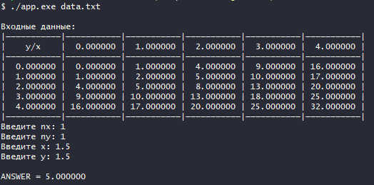
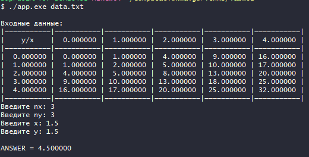
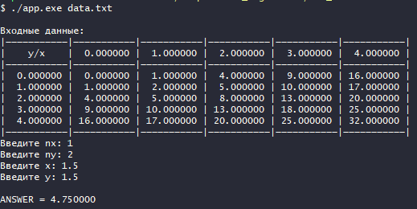
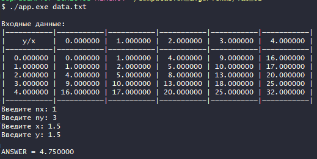
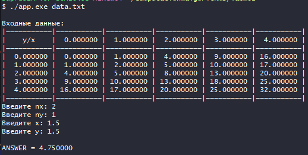
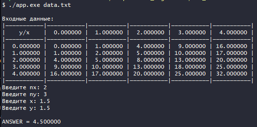
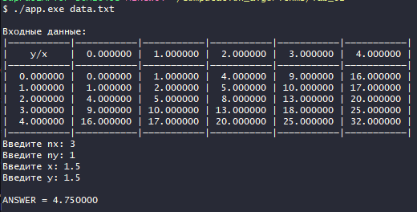
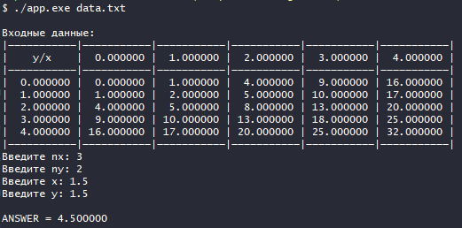

## Цель работы

Получение навыков построения алгоритма интерполяции таблично заданных функций двух переменных.

## Исходные данные

* Таблица функции  с количеством узлов 5x5.
  
  | y \ x | 0   | 1   | 2   | 3   | 4   |
  | ----- | --- | --- | --- | --- | --- |
  | 0     | 0   | 1   | 4   | 9   | 16  |
  | 1     | 1   | 2   | 5   | 10  | 17  |
  | 2     | 4   | 5   | 8   | 13  | 20  |
  | 3     | 9   | 10  | 13  | 18  | 25  |
  | 4     | 16  | 17  | 20  | 25  | 32  |

* Степень аппроксимирующего полинома - `nx` и `ny`.
* Значение аргументов  x, y, для которого выполняется интерполяция.

## Описание алгоритма

1. Выбираем узлы на которых будут строиться таблица разделенных разностей. (`nx + 1` узлов для оси `x` и `ny + 1` для оси `y`)

2. Проводим интерполяцию по `x` . При этом выполняется `ny + 1` одномерных интерполяций при выбранных значениях `y[j], j = 0,1,...ny`, и вычисляются значения функции `f(x, y[j]), j = 0,1,...ny`.

3. По полученным значениям функции, привязанным теперь к `y[j]` , совершается одна интерполяция по `y`.

## Код программы

```c
#define __USE_MINGW_ANSI_STDIO 1

#include <stdlib.h>
#include <stdio.h>

#define N 6
#define MAX_N 6

#define SUCCESS 0
#define INPUT_ERROR -1
#define MEMORY_ERROR -2
#define ARGV_ERROR -3
#define OPEN_FILE_ERROR -4
#define INVALID_N -5
#define INVALID_ARG -6
#define NO_ANSWER -7

typedef struct
{
    double x;
    double y;
} table_t;

void print_error(int err)
{
    if (err == INPUT_ERROR)
        printf("Ошибка ввода");
    else if (err == MEMORY_ERROR)
        printf("Ошибка выделения памяти");
    else if (err == ARGV_ERROR)
        printf("Ошибка при вводе аргументов командной строки");
    else if (err == OPEN_FILE_ERROR)
        printf("Ошибка открытия файла");
    else if (err == INVALID_N)
        printf("Некорректная степень полинома (0 <= n < %d)", MAX_N);
    else if (err == INVALID_ARG)
        printf("Некорректное значение аргумента для выполнения интерполяции");
    else if (err == NO_ANSWER)
        printf("Нет корня");
}

int input_data(FILE *f, double a[N][N])
{
    for (size_t i = 0; i < N; i++)
        for (size_t j = 0; j < N; j++)
            if (fscanf(f, "%lf", &a[i][j]) != 1)
            {
                printf("ERROR %zu %zu\n\n", i, j);
                return INPUT_ERROR;
            }

    return SUCCESS;
}

void output_data(double a[N][N])
{
    printf("\n");
    for (size_t i = 0; i < N; i++)
        printf("|———————————");
    printf("|\n|    y/x    ");
    for (size_t i = 1; i < N; i++)
    {
        printf("| %9lf ", a[0][i]);
    }
    printf("|\n");
    for (size_t i = 0; i < N; i++)
        printf("|———————————");
    printf("|\n");

    for (size_t i = 1; i < N; i++)
    {
        for (size_t j = 0; j < N; j++)
            printf("| %9lf ", a[i][j]);
        printf("|\n");
    }

    for (size_t i = 0; i < N; i++)
        printf("|———————————");
    printf("|\n");
}

int point_compare(const void *q, const void *p)
{
    const table_t *a = q;
    const table_t *b = p;
    return a->x - b->x;
}

double newton_p(table_t table[], int table_len, double arg, int n)
{
    double res[MAX_N][MAX_N]; // Для вычисления разделенных разностей
    double ans;

    qsort(table, table_len, sizeof(table_t), point_compare);

    // Построение таблицы разделенных разностей
    for (int i = 0; i <= table_len; i++)
        res[i][0] = table[i].y;

    for (int k = 1; k <= n; k++)
    {
        int res_i = 0;
        for (int j = 0; j < table_len - k + 1; j++)
        {
            res[res_i][k] = (res[res_i][k - 1] - res[res_i + 1][k - 1]) / (table[j].x - table[j + k].x);
            res_i++;
        }
    }

    ans = res[0][0];
    int cur_i = 0;
    double cur = arg - table[cur_i].x;
    for (int k = 1; k <= n; k++)
    {
        ans += cur * res[0][k];
        cur_i++;
        cur = cur * (arg - table[cur_i].x);
    }
    return ans;
}

void output_table(table_t table[N], int n)
{
    printf("\n|    x     |    y     |\n");
    for (int i = 0; i < n; i++)
        printf("|%10lf|%10lf|\n", table[i].x, table[i].y);
}

void swap(double *a, double *b)
{
    double buf = *a;
    *a = *b;
    *b = buf;
}

void swap_x_y(table_t table[], int table_len)
{
    for (int i = 0; i < table_len; i++)
        swap(&table[i].x, &table[i].y);
}

int select_point(double src[N][N], double dst[N][N], double arg_x[N], double arg_y[N], int nx, int ny, double px, double py)
{
    int err = EXIT_SUCCESS;
    int i = 1, j = 1;

    for (i = 1; px > src[0][i] && i < N; i++)
        ;
    for (j = 1; py > src[j][0] && j < N; j++)
        ;

    // printf("i = %d, j = %d\n", i, j);

    // Проверка, может ли быть построен полином Ньютона
    if (i < (nx + 1) / 2 + 1 || i > (N - (nx + 1) / 2 - 1))
        err = INVALID_ARG;
    if (err)
        return err;

    if (j < (ny + 1) / 2 + 1 || i > (N - (ny + 1) / 2 - 1))
        err = INVALID_ARG;
    if (err)
        return err;

    // Выбор узлов, на которых будет строиться таблица разделенных разностей
    int start_i = i - (nx + 1) / 2 - 1;
    int end_i = i + (nx + 1) / 2 - 1;

    if ((nx + 1) % 2 == 0)
        start_i += 1;
    if (start_i < 0)
    {
        end_i += 1;
        start_i += 1;
    }

    int start_j = j - (ny + 1) / 2 - 1;
    int end_j = j + (ny + 1) / 2 - 1;

    if ((ny + 1) % 2 == 0)
        start_j += 1;
    if (start_j < 0)
    {
        end_j += 1;
        start_j += 1;
    }

    // Запоминание соответсвующих x и y
    int dst_i = 0;
    for (int i = start_i; i <= end_i; i++)
        arg_x[dst_i++] = src[0][i];

    dst_i = 0;
    for (int i = start_j; i <= end_j; i++)
        arg_y[dst_i++] = src[i][0];

    // Заполнение таблицы узлами
    dst_i = 0;
    for (int j = start_j; j <= end_j; j++)
    {
        int dst_j = 0;
        for (int i = start_i; i <= end_i; i++)
        {
            dst[dst_i][dst_j] = src[i][j];
            dst_j++;
        }
        dst_i++;
    }

    return SUCCESS;
}

void output_matrix(double a[N][N], int rows, int columns)
{
    for (int i = 0; i < rows; i++)
    {
        for (int j = 0; j < columns; j++)
            printf("%lf ", a[i][j]);
        printf("\n");
    }
}

void output_array(double a[N], int n)
{
    for (int i = 0; i < n; i++)
        printf("%lf ", a[i]);
}

int main(int argc, char **argv)
{
    FILE *f; // Файл с данными
    int err = SUCCESS;
    double data[N][N]; // Введенная таблица
    int nx, ny;
    double px, py;
    double arg_x[N], arg_y[N];
    table_t table[N];
    double x_newton_p[N];
    double ans;
    double d[N][N]; // Таблица с необходимыми для заданной степени полинома значениями

    setbuf(stdout, NULL);

    if (argc != 2)
    {
        err = ARGV_ERROR;
        print_error(err);
        return err;
    }

    f = fopen(argv[1], "r");
    if (!f)
    {
        err = OPEN_FILE_ERROR;
        print_error(err);
        return err;
    }

    err = input_data(f, data);
    if (err)
    {
        fclose(f);
        print_error(err);
        return err;
    }

    fclose(f);

    printf("\nВходные данные:");
    output_data(data);

    printf("Введите nx: ");
    if (scanf("%d", &nx) != 1)
    {
        print_error(INPUT_ERROR);
        return INPUT_ERROR;
    }

    printf("Введите ny: ");
    if (scanf("%d", &ny) != 1)
    {
        print_error(INPUT_ERROR);
        return INPUT_ERROR;
    }

    printf("Введите x: ");
    if (scanf("%lf", &px) != 1)
    {
        print_error(INPUT_ERROR);
        return INPUT_ERROR;
    }

    printf("Введите y: ");
    if (scanf("%lf", &py) != 1)
    {
        print_error(INPUT_ERROR);
        return INPUT_ERROR;
    }

    err = select_point(data, d, arg_x, arg_y, nx, ny, px, py);
    if (err)
    {
        print_error(err);
        return err;
    }

    // output_matrix(d, ny + 1, nx + 1);
    // printf("\nx: ");
    // output_array(arg_x, nx + 1);
    // printf("\ny: ");
    // output_array(arg_y, ny + 1);

    for (int i = 0; i < nx + 1; i++)
        table[i].x = arg_x[i];

    for (int i = 0; i < ny + 1; i++)
    {
        for (int j = 0; j < nx + 1; j++)
            table[j].y = d[i][j];
        x_newton_p[i] = newton_p(table, nx + 1, px, nx);
        // output_table(table, nx + 1);
    }

    // printf("\nx_newton_p: ");
    // output_array(x_newton_p, ny + 1);

    for (int i = 0; i < ny + 1; i++)
    {
        table[i].x = arg_y[i];
        table[i].y = x_newton_p[i];
    }

    // output_table(table, ny + 1);

    ans = newton_p(table, ny + 1, py, ny);

    printf("\nANSWER = %lf\n", ans);

    return SUCCESS;
}
```

## Результат работы

* При `nx = ny = 1, x = y = 1.5`:
  
* При `nx = ny = 2, x = y = 1.5`:
  
* При `nx = ny = 3, x = y = 1.5`:
  
* При `nx = 1, ny = 2, x = y = 1.5`:
  
* При `nx = 1, ny = 3, x = y = 1.5`:
  
* При `nx = 2, ny = 1, x = y = 1.5`:
  
* При `nx = 2, ny = 3, x = y = 1.5`:
  
* При `nx = 3, ny = 1, x = y = 1.5`:
  
* При `nx = 3, ny = 2, x = y = 1.5`:
  

В итоге:

При `x=y=1.5`

| `ny/nx` | 1    | 2    | 3    |
| ------- | ---- | ---- | ---- |
| **1**   | 5.0  | 4.75 | 4.75 |
| **2**   | 4.75 | 4.5  | 4.5  |
| **3**   | 4.75 | 4.5  | 4.5  |

## Вопросы при защите лабораторной работы

1. *Пусть производящая функция таблицы суть `z(x,y)=x2+y2`. Область определения по `x` и `y` 0-5 и 0-5. Шаги по переменным равны 1. Степени `nx = ny =1, x=y=1.5`. Приведите по шагам те. значения функции, которые получаются в ходе последовательных интерполяций. по строкам и столбцу.*
   | y\x   | ... | 1   | 2   | ... |
   | ----- | --- | --- | --- | --- |
   | ...   |     |     |     |     |
   | **1** |     | 2   | 5   |     |
   | **2** |     | 5   | 8   |     |
   | ...   |

   Конфигурация узлов по `x`: 1, 2

   Конфигурация узлов по `y`: 1, 2

   1. Интерполируем по `x` при `y=1`.
   
       `z(x,y)=3.5`
   2. Интерполируем по `x` при `y=2`.
   
       `z(x,y)=6.5`
    
   3. Интерполируем по `y` при полученных выше значениях функции.
   
       `z(x,y)=5`

2. *Какова минимальная степень двумерного полинома, построенного на четырех узлах? На шести узлах?*
   
   Полином второй степени выглядит следующим образом: `z = a + bx + cy + dx^2 + ey^2 + fxy`

   При таком полиноме максимум используется 6 узлов, поэтому и для 4 узлов и для 6 узлов минимальная степень полинома = 2.

3. *Предложите алгоритм двумерной интерполяции при хаотичном расположении узлов, т.е. когда таблицы функции на регулярной сетке нет, и метод последовательной интерполяции не работает. Какие имеются ограничения на расположение узлов при разных степенях полинома?*
   
   В данной ситуации узлы, количество которых соответсвует числу неизвестных коэффициентов в полиноме следует выбирать в окрестности точки интерполяции. (Для полинома первой степени - 3 узла, для полинома второй степени - 6 узлов и т.д.) После этого выбранные узлы подставляются в полином, образуется система, из которой выражаются все необходимые коэффициенты.

4. *Пусть на каком-либо языке программирования написана функция, выполняющая интерполяцию по  двум переменным. Опишите алгоритм использования этой функции для интерполяции по трем переменным.*
   
   1. Создать конфигурацию узлов по третьей переменной.
   2. Для каждого значения третьей переменной проводится двумерная интерполяция.
   3. Исходя их полученных в п.2. результатов проводится одномерная интерполяция по третьей переменной.
   
5. *Можно ли при последовательной интерполяции по разным направлениям использовать полиномы несовпадающих  степеней или даже разные методы одномерной интерполяции, например, полином Ньютона и сплайн?*
   
   Можно. Для последующих интерполяцийв других направлениях важен только результат. (Способ получения этого результата и степени полиномов не играют роли)

6. *Опишите алгоритм двумерной интерполяции на треугольной конфигурации узлов.*
   
   Алгоритм двумерной интерполяции на треугольной конфигурации узлов сводится к вычислению разделенных разностей и полинома Ньютона.

   Пример вычисления разделенных разностей:
   
   

   Многочлен n-й степени в форме Ньютона для двумерной интерполяции в этом случае можно представить как обобщение одномерного варианта записи:

   
