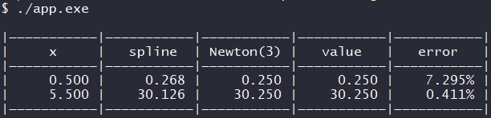
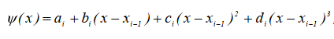
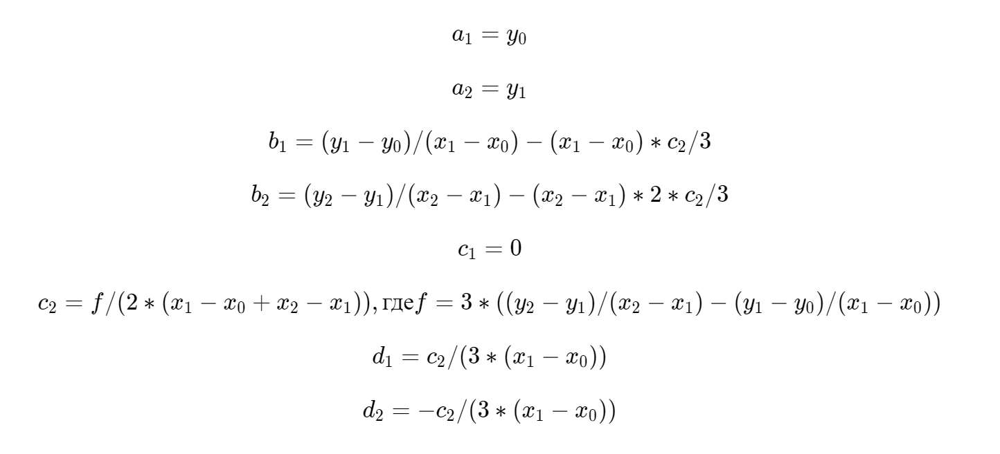
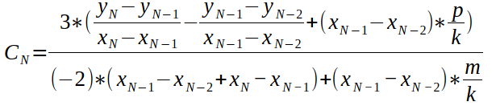

## Цель работы

Получение навыков владения методами интерполяции таблично заданных функций с помощью кубических сплайнов.

## Исходные данные

1. Таблица функции с количеством узлов N. Задать с помощью формулы y = x2 в диапазоне [0..10] с шагом 1.
2. Таблица функции с количеством узлов N. Задать с помощью формулы y = x2 в диапазоне [0..10] с шагом 1.

## Код программы

Программа состоит из одного файла. Задаваемая таблица генерируется и хранится внутри файла.

```c
#define __USE_MINGW_ANSI_STDIO 1

#include <stdlib.h>
#include <stdio.h>
#include <math.h>

#define N 11

#define SUCCESS 0
#define INPUT_ERROR -1
#define MEMORY_ERROR -2
#define ARGV_ERROR -3
#define OPEN_FILE_ERROR -4
#define INVALID_N -5
#define INVALID_ARG -6
#define NO_ANSWER -7

typedef struct
{
    double x;
    double y;
} point_t;

typedef point_t table_t[N];

typedef struct
{
    double x;
    size_t ind;
    double h[N];
    double a_coef[N];
    double b_coef[N - 1];
    double c_coef[N];
    double d_coef[N - 1];
} spline_t;

void h_calc(spline_t *data)
{
    for (size_t i = 0; i < N; i++)
        data->h[i] = 1;
}

void c_calc(spline_t *data, table_t table)
{
    double e[N + 1], n[N + 1], f[N];

    for (size_t i = 0; i < N; i++)
        f[i] = 3 * ((table[i].y - table[i - 1].y) / data->h[i] - (table[i - 1].y - table[i - 2].y) / data->h[i - 1]);

    e[2] = 0;
    n[2] = 0;

    for (size_t i = 3; i < N + 1; i++)
    {
        e[i] = data->h[i - 1] / (data->h[i - 2] * e[i - 1] +
                                 2 * (data->h[i - 2] + data->h[i - 1]));
        n[i] = (f[i - 1] - data->h[i - 2] * n[i - 1]) /
               (data->h[i - 2] * e[i - 1] + 2 * (data->h[i - 2] + data->h[i - 1]));
    }

    data->c_coef[1] = 0;
    data->c_coef[N] = 0;

    for (size_t i = N; i > 1; i--)
        data->c_coef[i] = e[i + 1] * data->c_coef[i + 1] + n[i + 1];
}

void a_calc(spline_t *data, table_t table)
{
    for (size_t i = 1; i < N; i++)
        data->a_coef[i] = table[i - 1].y;
}

void b_calc(spline_t *data)
{
    for (size_t i = 1; i < N - 1; i++)
        data->b_coef[i] = (data->a_coef[i + 1] - data->a_coef[i]) / data->h[i] -
                          data->h[i] * (data->c_coef[i + 1] + 2 * data->c_coef[i]) / 3;

    data->b_coef[N - 1] = (data->a_coef[N - 1] - data->a_coef[N - 2]) / data->h[N - 1] -
                          data->h[N - 1] * 2 * data->c_coef[N - 1] / 3;
}

void d_calc(spline_t *data)
{
    for (size_t i = 1; i < N - 1; i++)
        data->d_coef[i] = (data->c_coef[i + 1] - data->c_coef[i]) / 3 / data->h[i];
    data->d_coef[N - 1] = -data->c_coef[N - 1] / 3 / data->h[N - 1];
}

double res_calc(spline_t *data)
{
    double res;
    double dif = data->x - data->ind + 1;

    res = data->a_coef[data->ind] +
          data->b_coef[data->ind] * dif +
          data->c_coef[data->ind] * dif * dif +
          data->d_coef[data->ind] * dif * dif * dif;

    return res;
}

double spline_calc(spline_t *data, table_t table)
{
    double res = 0;

    h_calc(data);
    c_calc(data, table);
    a_calc(data, table);
    b_calc(data);
    d_calc(data);

    res = res_calc(data);

    return res;
}

void print_error(int err)
{
    if (err == INPUT_ERROR)
        printf("Ошибка ввода");
    else if (err == MEMORY_ERROR)
        printf("Ошибка выделения памяти");
    else if (err == ARGV_ERROR)
        printf("Ошибка при вводе аргументов командной строки");
    else if (err == OPEN_FILE_ERROR)
        printf("Ошибка открытия файла");
}

double func(double x)
{
    return x * x;
}

void fill_matrix(table_t mtx, size_t n)
{
    for (size_t i = 0; i <= n; i++)
    {
        mtx[i].x = i;
        mtx[i].y = func(i);
    }
}

void output_matrix(table_t mtx, size_t n)
{
    for (size_t i = 0; i <= n; i++)
        printf("%lf %lf\n", mtx[i].x, mtx[i].y);
}

size_t index_definition(table_t mtx, double x)
{
    size_t ind = 0;

    for (ind = 0; ind < N && mtx[ind].x < x; ind++)
        ;

    return ind;
}

double newton_p(table_t table, int table_len, double arg, int n)
{
    double res[N][N];
    double ans;

    for (int i = 0; i <= table_len; i++)
        res[i][0] = table[i].y;

    for (int k = 1; k <= n; k++)
    {
        int res_i = 0;
        for (int j = 0; j < table_len - k + 1; j++)
        {
            res[res_i][k] = (res[res_i][k - 1] - res[res_i + 1][k - 1]) / (table[j].x - table[j + k].x);
            res_i++;
        }
    }

    ans = res[0][0];
    int cur_i = 0;
    double cur = arg - table[cur_i].x;
    for (int k = 1; k <= n; k++)
    {
        ans += cur * res[0][k];
        cur_i++;
        cur = cur * (arg - table[cur_i].x);
    }
    return ans;
}

int main(void)
{
    spline_t data;
    table_t mtx;

    setbuf(stdout, NULL);

    fill_matrix(mtx, N);

    printf("\n|———————————|———————————|———————————|———————————|———————————|");
    printf("\n|     x     |   spline  | Newton(3) |   value   |   error   |");
    printf("\n|———————————|———————————|———————————|———————————|———————————|");

    data.x = 0.5;
    data.ind = index_definition(mtx, data.x);
    double spl = spline_calc(&data, mtx);
    double newton = newton_p(mtx, N, data.x, 3);
    double value = func(data.x);
    double error = fabs(100 - spl * 100 / value);

    printf("\n| %9.3lf | %9.3lf | %9.3lf | %9.3lf | %8.3lf%% |", data.x, spl, newton, value, error);

    data.x = 5.5;
    data.ind = index_definition(mtx, data.x);
    spl = spline_calc(&data, mtx);
    newton = newton_p(mtx, N, data.x, 3);
    value = func(data.x);
    error = fabs(100 - spl * 100 / value);

    printf("\n| %9.3lf | %9.3lf | %9.3lf | %9.3lf | %8.3lf%% |", data.x, spl, newton, value, error);
    printf("\n|———————————|———————————|———————————|———————————|———————————|");

    return SUCCESS;
}
```

## Результат работы



Можно заметить, что при х близком к 0 погрешность довольно велика. Такой результат получается из-за обратного хода при определении соэффициентов С.

## Вопросы при защите лабораторной работы

1. *Получить выражение для коэффициентов кубического сплайна, построенного на двух точках.*
   
   Кубический сплайн следующего вида: , - будет иметь коэффициенты:
   
   ```
   a = y[0]
   b = (y[1] - y[0])/(x[1] - x[0]) * (x - x[0])
   c = 0
   d = 0
   ```

2. *Выписать все условия для определения коэффициентов сплайна, построенного на 3-х точках.*
   
   

3. *Определить начальные значения прогоночных коэффициентов, если принять, что для коэффициентов сплайна справедливо C1 = C2.*
   
   В данном случае в следующей формуле: `c[i - 1] = ξ[i] * c[i] + η[i]`, - можно заменить `С[i]` на `С[i + 1]` и получим, что `ξ = 1`, а `η = 0`

4. *Написать формулу для определения последнего коэффициента сплайна CN, чтобы можно было выполнить обратный ход метода прогонки, если в качестве граничного условия задано kCN-1 + mCN = p, где k, m, p – заданные числа.*
   
   