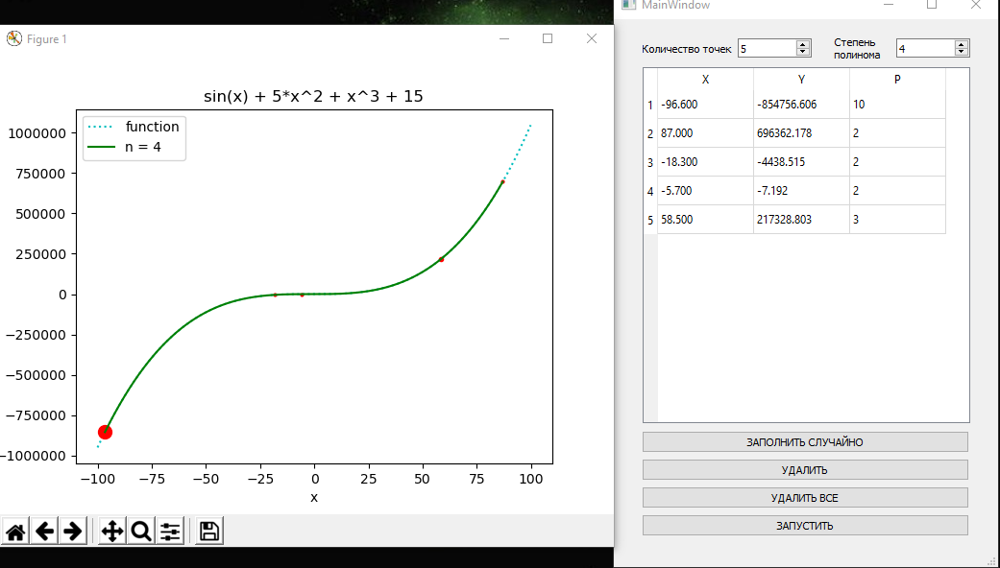

## Цель работы

Построение и программная реализация алгоритма наилучшего среднеквадратичного приближения.

## Исходные данные

1. Таблица функции `y(x) = sin(x) + 5*x^2 + x^3 + 15` с весами `p[i]` с количеством узлов N.

2. Степень аппроксимирующего полинома - `n`.

## Описание алгоритма

1. Выбрать степень полинома `n << N`. Обычно степень полиноа не превышает 5-6.
2. Составить СЛАУ типа 
3. В результате решения СЛАУ (в данном случае решение было получено методом Гаусса-Жордана) находятся коэффициенты полинома `a[k]`.

## Код программы

Программа состоит из 3 файлов:

* design.py - описание интерфейса (сгенерирован автоматически с помощью программы Qt Designer)
* main.py - взаимодействие интерфейса и реализации (ввод, вывод таблицы, рисование графиков)
* alg.py - реализация алгоритма
  
`design.py`
```c
# -*- coding: utf-8 -*-

#
# Created by: PyQt5 UI code generator 5.15.3
#
# WARNING: Any manual changes made to this file will be lost when pyuic5 is
# run again.  Do not edit this file unless you know what you are doing.


from PyQt5 import QtCore, QtGui, QtWidgets


class Ui_MainWindow(object):
    def setupUi(self, MainWindow):
        MainWindow.setObjectName("MainWindow")
        MainWindow.resize(400, 571)
        self.centralwidget = QtWidgets.QWidget(MainWindow)
        self.centralwidget.setObjectName("centralwidget")
        self.gridLayoutWidget = QtWidgets.QWidget(self.centralwidget)
        self.gridLayoutWidget.setGeometry(QtCore.QRect(30, 50, 341, 371))
        self.gridLayoutWidget.setObjectName("gridLayoutWidget")
        self.gridLayout = QtWidgets.QGridLayout(self.gridLayoutWidget)
        self.gridLayout.setContentsMargins(0, 0, 0, 0)
        self.gridLayout.setObjectName("gridLayout")
        self.tableWidget = QtWidgets.QTableWidget(self.gridLayoutWidget)
        self.tableWidget.setEnabled(True)
        self.tableWidget.setSizeAdjustPolicy(QtWidgets.QAbstractScrollArea.AdjustToContents)
        self.tableWidget.setObjectName("tableWidget")
        self.tableWidget.setColumnCount(3)
        self.tableWidget.setRowCount(0)
        item = QtWidgets.QTableWidgetItem()
        item.setTextAlignment(QtCore.Qt.AlignCenter)
        self.tableWidget.setHorizontalHeaderItem(0, item)
        item = QtWidgets.QTableWidgetItem()
        item.setTextAlignment(QtCore.Qt.AlignCenter)
        self.tableWidget.setHorizontalHeaderItem(1, item)
        item = QtWidgets.QTableWidgetItem()
        item.setText("P")
        item.setTextAlignment(QtCore.Qt.AlignCenter)
        self.tableWidget.setHorizontalHeaderItem(2, item)
        self.gridLayout.addWidget(self.tableWidget, 0, 0, 1, 2)
        self.verticalLayoutWidget = QtWidgets.QWidget(self.centralwidget)
        self.verticalLayoutWidget.setGeometry(QtCore.QRect(29, 429, 341, 112))
        self.verticalLayoutWidget.setObjectName("verticalLayoutWidget")
        self.verticalLayout = QtWidgets.QVBoxLayout(self.verticalLayoutWidget)
        self.verticalLayout.setContentsMargins(0, 0, 0, 0)
        self.verticalLayout.setObjectName("verticalLayout")
        self.Qbtn_random = QtWidgets.QPushButton(self.verticalLayoutWidget)
        self.Qbtn_random.setObjectName("Qbtn_random")
        self.verticalLayout.addWidget(self.Qbtn_random)
        self.Qbtn_delete = QtWidgets.QPushButton(self.verticalLayoutWidget)
        self.Qbtn_delete.setObjectName("Qbtn_delete")
        self.verticalLayout.addWidget(self.Qbtn_delete)
        self.Qbtn_delete_all = QtWidgets.QPushButton(self.verticalLayoutWidget)
        self.Qbtn_delete_all.setObjectName("Qbtn_delete_all")
        self.verticalLayout.addWidget(self.Qbtn_delete_all)
        self.Qbtn_run = QtWidgets.QPushButton(self.verticalLayoutWidget)
        self.Qbtn_run.setObjectName("Qbtn_run")
        self.verticalLayout.addWidget(self.Qbtn_run)
        self.gridLayoutWidget_2 = QtWidgets.QWidget(self.centralwidget)
        self.gridLayoutWidget_2.setGeometry(QtCore.QRect(30, 10, 341, 41))
        self.gridLayoutWidget_2.setObjectName("gridLayoutWidget_2")
        self.gridLayout_2 = QtWidgets.QGridLayout(self.gridLayoutWidget_2)
        self.gridLayout_2.setContentsMargins(0, 0, 0, 0)
        self.gridLayout_2.setObjectName("gridLayout_2")
        self.label = QtWidgets.QLabel(self.gridLayoutWidget_2)
        self.label.setObjectName("label")
        self.gridLayout_2.addWidget(self.label, 1, 0, 1, 1)
        self.QSB_n = QtWidgets.QSpinBox(self.gridLayoutWidget_2)
        self.QSB_n.setMinimum(1)
        self.QSB_n.setObjectName("QSB_n")
        self.gridLayout_2.addWidget(self.QSB_n, 1, 1, 1, 1)
        self.label_5 = QtWidgets.QLabel(self.gridLayoutWidget_2)
        self.label_5.setObjectName("label_5")
        self.gridLayout_2.addWidget(self.label_5, 1, 2, 1, 1)
        self.QSB_power = QtWidgets.QSpinBox(self.gridLayoutWidget_2)
        self.QSB_power.setMinimum(1)
        self.QSB_power.setObjectName("QSB_power")
        self.gridLayout_2.addWidget(self.QSB_power, 1, 3, 1, 1)
        MainWindow.setCentralWidget(self.centralwidget)
        self.menubar = QtWidgets.QMenuBar(MainWindow)
        self.menubar.setGeometry(QtCore.QRect(0, 0, 400, 21))
        self.menubar.setObjectName("menubar")
        MainWindow.setMenuBar(self.menubar)
        self.statusbar = QtWidgets.QStatusBar(MainWindow)
        self.statusbar.setObjectName("statusbar")
        MainWindow.setStatusBar(self.statusbar)

        self.retranslateUi(MainWindow)
        QtCore.QMetaObject.connectSlotsByName(MainWindow)

    def retranslateUi(self, MainWindow):
        _translate = QtCore.QCoreApplication.translate
        MainWindow.setWindowTitle(_translate("MainWindow", "MainWindow"))
        item = self.tableWidget.horizontalHeaderItem(0)
        item.setText(_translate("MainWindow", "X"))
        item = self.tableWidget.horizontalHeaderItem(1)
        item.setText(_translate("MainWindow", "Y"))
        self.Qbtn_random.setText(_translate("MainWindow", "ЗАПОЛНИТЬ СЛУЧАЙНО"))
        self.Qbtn_delete.setText(_translate("MainWindow", "УДАЛИТЬ"))
        self.Qbtn_delete_all.setText(_translate("MainWindow", "УДАЛИТЬ ВСЕ"))
        self.Qbtn_run.setText(_translate("MainWindow", "ЗАПУСТИТЬ"))
        self.label.setText(_translate("MainWindow", "Количество точек"))
        self.label_5.setText(_translate("MainWindow", "      Степень \n"
"      полинома"))

```

`main.py`

```c
import sys
from PyQt5 import QtWidgets
from PyQt5.QtWidgets import QTableWidgetItem, QTableWidget
import design
from alg import *
from math import *
import numpy as np
import random as r
import time
import matplotlib.pyplot as plt


class App(QtWidgets.QMainWindow, design.Ui_MainWindow):

    def __init__(self):
        super(App, self).__init__()
        self.ui = design.Ui_MainWindow()
        self.ui.setupUi(self)

        self.ui.QSB_n.valueChanged.connect(self.change_n)

        self.ui.Qbtn_random.clicked.connect(self.fill_in_randomly)
        self.ui.Qbtn_delete_all.clicked.connect(self.delete_all)
        self.ui.Qbtn_delete.clicked.connect(self.delete)
        self.ui.Qbtn_run.clicked.connect(self.run)

        self.create_table()

    def change_n(self):
        n = self.ui.QSB_n.value()

        self.ui.tableWidget.clearContents()

        self.ui.tableWidget.setColumnCount(3)
        self.ui.tableWidget.setRowCount(n)

    def create_table(self):
        n = self.ui.QSB_n.value()

        self.ui.tableWidget.setColumnCount(3)
        self.ui.tableWidget.setRowCount(n)

    def fill_in_randomly(self):
        n = self.ui.QSB_n.value()
        table = self.ui.tableWidget

        dtype = [('x', float), ('y', float), ('p', float)]
        x = np.arange(-100, 100, 0.1)
        y = np.array([(sin(x[i]) + 5*x[i]*x[i] + x[i]**3 + 15)
                      for i in range(2000)])
        p = np.array([r.randint(1, 10) for i in range(2000)])

        dots = np.array([(x[i], y[i], p[i]) for i in range(2000)], dtype=dtype)
        self.func = [x, y]
        self.repeat = 0
        np.random.shuffle(dots)

        result_points = np.array([dots[i] for i in range(n)])

        for i in range(n):
            table.setItem(i, 0, QTableWidgetItem(
                '{:.3f}'.format(result_points[i]['x'])))
            table.setItem(i, 1, QTableWidgetItem(
                '{:.3f}'.format(result_points[i]['y'])))
            table.setItem(i, 2, QTableWidgetItem(
                '{:.0f}'.format(result_points[i]['p'])))

    def get_table(self, dots):
        n = self.ui.QSB_n.value()

        table = self.ui.tableWidget

        dots.clear()

        for i in range(n):
            x = float(table.item(i, 0).text())
            y = float(table.item(i, 1).text())
            p = float(table.item(i, 2).text())
            dots.append((x, y, p))

    def delete_all(self):
        self.ui.tableWidget.clear()

    def delete(self):
        self.ui.tableWidget.removeRow(self.ui.tableWidget.currentRow())

        if self.ui.tableWidget.rowCount() == 0:
            self.ui.tableWidget.setColumnCount(3)
            self.ui.tableWidget.setRowCount(1)

    def run(self):
        self.repeat += 1
        dots = []
        color = ['b', 'g', 'm', 'y', 'k']
        self.get_table(dots)
        power = self.ui.QSB_power.value()
        a = root_mean_square(dots, power+1)
        min_x = max_x = dots[0][0]

        plt.figure(1)
        plt.ylabel('y')
        plt.xlabel('x')
        plt.title('sin(x[i]) + 5*x[i]*x[i] + x[i]**3 + 15')

        if (self.repeat == 1):
            plt.plot(self.func[0], self.func[1], 'c:', label='function')

        for i in range(self.ui.QSB_n.value()):
            if dots[i][0] < min_x:
                min_x = dots[i][0]
            elif dots[i][0] > max_x:
                max_x = dots[i][0]
            plt.plot(dots[i][0], dots[i][1], 'ro', markersize=dots[i][2])

        t = np.arange(min_x, max_x, 0.02)
        plt.plot(t, f(t, a), color[r.randint(0, 4)], label='n = ' + str(power))
        plt.legend()
        plt.show()


def main():
    app = QtWidgets.QApplication(sys.argv)
    window = App()
    window.show()
    app.exec_()


if __name__ == '__main__':
    main()
```

`alg.py`

```c
import numpy as np


def root_mean_square(dots, n):  # n - количество искомых коэффициентов
    length = int(np.size(dots) / len(dots[0]))

    sum_x_n = [sum([dots[i][0] ** j * dots[i][2]
                    for i in range(length)]) for j in range(2*n - 1)]
    sum_y_x_n = [sum([dots[i][0]**j*dots[i][2]*dots[i][1]
                      for i in range(length)]) for j in range(n)]

    mtx = [sum_x_n[i:i+n] for i in range(n)]

    for i in range(n):
        mtx[i].append(sum_y_x_n[i])

    return Gauss(mtx)


def Gauss(mtx):
    n = len(mtx)
    # приведение к треугольному виду
    for k in range(n):
        for i in range(k + 1, n):
            coef = -(mtx[i][k]/mtx[k][k])
            for j in range(k, n + 1):
                mtx[i][j] += coef * mtx[k][j]

    # находим неизвестные
    a = [0 for i in range(n)]
    for i in range(n - 1, -1, -1):
        for j in range(n - 1, i, -1):
            mtx[i][n] -= a[j] * mtx[i][j]
        a[i] = mtx[i][n]/mtx[i][i]

    return a


def f(x_arr, coeff):
    res = np.zeros(len(x_arr))
    for i in range(len(coeff)):
        res += coeff[i]*(x_arr**i)
    return res
```

## Результат работы

1. Веса всех точек одинаковы и равны единице. (n - степень полинома)
   
   

   

2. Веса точек разные.
   
   Фиолетовая прямая - веса точек одинаковые.

   Синяя прямая - веса точек различны.
   
   

   

## Вопросы при защите лабораторной работы

1. *Что произойдет при задании  степени полинома n=N-1 (числу узлов таблицы минус 1)?*
   
   Для однозначного определения полинома `n = N - 1` степени достаточно `n` точек, поэтому полином будет построен таким образом, что его график будет проходить через все табличные точки. Более того, при любых заданный весах, значение полинома будет минимальным в случае проходп через табличные точки.

   Ниже представлен результат работы программы при условии `n = N - 1`
   
   

   
2. *Будет ли работать Ваша программа при n >= N ? Что именно в алгоритме требует отдельного анализа данного случая и может привести к аварийной остановке?*
   
   При `n >= N` определитель СЛАУ = 0 (уравнения СЛАУ не будут линейно-независимыми), поэтому аварийная остановка программы может произойти при приведении диагональной матрицы к единичной, где может произойти деление на 0.

   Решением этой проблемы может быть анализ, который нужно проводить при решении СЛАУ на начальном этапе (ввод степени полинома).

   Программа будет работать из-за погрешности вычислений. Ниже представлен результат работы.

   
3. *Получить формулу для коэффициента полинома a0 при степени полинома n=0. Какой смысл имеет  величина, которую представляет данный коэффициент?*
   
   

   Представленную выше формулу, где `p[i]` - все точки `I`, можно преобразовать делением числителя и знаменателя на сумму весов и получить математическое ожидание.

   

4. *Записать и вычислить определитель матрицы СЛАУ для нахождения коэффициентов полинома для случая, когда n=N=2. Принять все p[i] = 1.*
   
   Предположим, таблица имеет следующий вид:

   | `x[i]` | `y[i]` | `p[i]` |
   | ------ | ------ | ------ |
   | x[0]   | y[0]   | 1      |
   | x[1]   | y[1]   | 1      |

   Тогда СЛАУ будет иметь следующий вид:

   

   Так как определитель СЛАУ = 0, решения нет.
5. *Построить СЛАУ при выборочном задании степеней аргумента полинома  , причем степени n и m в этой формуле известны.*
   
   
6. *Предложить схему алгоритма решения задачи из вопроса 5, если степени n и m подлежат определению наравне с коэффициентами ak , т.е. количество неизвестных равно 5.*
   
   1. Перебрать все возможные пары n и m.
   2. Для каждой пары n и m (см п.1.) найти все коэффициенты и ошибку.
   3. Среди всех полученных наборов выбрать тот, у которого ошибка минимальна.
