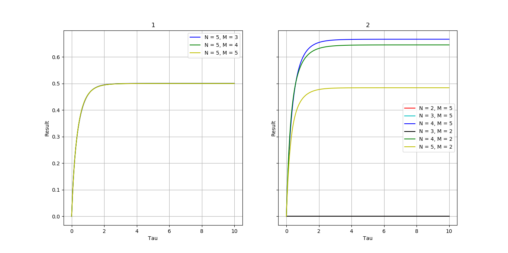
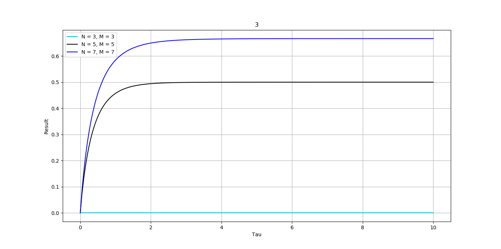

<script type="text/javascript" src="http://cdn.mathjax.org/mathjax/latest/MathJax.js?config=TeX-AMS-MML_HTMLorMML"></script>
<script type="text/x-mathjax-config"> MathJax.Hub.Config({ tex2jax: {inlineMath: [['$', '$']]}, messageStyle: "none" });</script>

## Цель работы

Получение навыков построения алгоритма вычисления двукратного интеграла с использованием квадратурных формул Гаусса и Симпсона.

## Исходные данные

Построить алгоритм и программу для вычисления двукратного интеграла при фиксированном значении параметра $\tau$.

$$\epsilon(\tau) = \frac{4}{\pi}\int_{0}^{\pi/2}d\phi\int_0^{\pi/2}[1-exp(-\tau\frac{l}{R})]cos\theta sin\theta d\theta$$

где $$\frac{l}{R} = \frac{2cos\theta}{1 - sin^2\theta cos^2\phi}$$,

$\theta, \phi - $ углы сферических  координат

Применить метод последовательного интегрирования. По одному направлению использовать формулу Гаусса, а по другому — формулу Симпсона.

## Код программы

```py
from math import sin, cos, pi, exp, fabs
import numpy as np
import matplotlib.pyplot as plt

eps = 1e-7

n, m = 0, 0
a, b, c, d = 0, pi/2, 0, pi/2
tau = 0
phi = []


def func(tau, teta, phi):
    return (1 - exp(-tau * 2 * cos(teta) / (1 - (sin(teta))**2) * (cos(phi))**2)) * cos(teta) * sin(teta)


def init_params():
    global n, m, tau
    print("Input N: ", end="")
    n = int(input())
    print("Input M: ", end="")
    m = int(input())
    print("Input tau: ", end="")
    tau = float(input())

    phi_init()


def phi_init():
    global n, phi
    piece = pi / 2 / n
    phi = [piece * i for i in range(n)]


def simpson_calc(integrals):
    global n, d, c
    h = (d - c) / (n - 1)
    res = 0

    for i in range(int(n / 2 - 1)):
        res += integrals[2 * i] + 4 * \
            integrals[2 * i + 1] + integrals[2 * i + 2]

    return res * h / 3 * 4 / pi  # 4/pi - коэф заданной функции


def legendre_polynom_calc(x, y):
    if y == 0:
        return 1

    if y == 1:
        return x

    leg_0, leg_1, leg_2 = 1, x, 0

    for i in range(2, y + 1):
        leg_2 = ((2 * i - 1) * x * leg_1 - (i - 1) * leg_0) / i
        leg_0 = leg_1
        leg_1 = leg_2

    return leg_2


def bisection(left, right, k):
    middle = (left + right) / 2

    if fabs(legendre_polynom_calc(middle, k)) < eps:
        return middle

    if legendre_polynom_calc(left, k) * legendre_polynom_calc(middle, k) < 0:
        right = middle
    else:
        left = middle

    while (right - left > eps):
        if fabs(legendre_polynom_calc(middle, k)) < eps:
            return middle

        if legendre_polynom_calc(left, k) * legendre_polynom_calc(middle, k) < 0:
            right = middle
        else:
            left = middle

        middle = (left + right) / 2

    return middle


def gauss_calc():
    global n, m, tau, phi, a, b, c, d
    x = []
    x_len = 0
    step = 2 / m

    while (x_len < m):
        step /= 2
        a = -1
        b = a + step
        while (a < 1):
            if legendre_polynom_calc(a, m) * legendre_polynom_calc(b, m) < 0:
                x_len += 1
            a = b
            b += step

    a = -1
    b = a + step
    i = 0

    while (a < 1 and i < m):
        if legendre_polynom_calc(a, m) * legendre_polynom_calc(b, m) < 0:
            x.append(bisection(a, b, m))
            i += 1
        a = b
        b += step

    right_slae = []
    for i in range(m):
        if (i % 2 == 0):
            right_slae.append(2.0 / (i + 1))
        else:
            right_slae.append(0)

    help_slae = [1 for i in range(m)]
    left_slae = [[] for i in range(m)]
    for i in range(m):
        for j in range(m):
            left_slae[i].append(help_slae[j])
            help_slae[j] *= x[j]

    r_slae = np.asarray(right_slae)
    l_slae = np.asarray(left_slae)

    weights = np.linalg.solve(l_slae, r_slae)

    for i in range(m):
        x[i] = pi / 4 * (1 + x[i])

    integrals = [0 for i in range(n)]

    for i in range(n):
        for j in range(m):
            integrals[i] += weights[j] * func(tau, x[j], phi[i])
        integrals[i] *= pi / 4

    return integrals


def plot_result():
    global n, m, tau, phi, a, b, c, d

    fig, axs = plt.subplots(1, 2, sharex=True, sharey=True)
    fig_1, ax = plt.subplots(1, 1, sharex=True, sharey=True)

    angle = np.linspace(0, 10, 200)

    # equal n
    n, m = 5, 2
    phi_init()

    m = 3
    res_2 = []
    for i in range(len(angle)):
        tau = angle[i]
        res_2.append(simpson_calc(gauss_calc()))
    axs[0].plot(angle, res_2, color="b", label="N = 5, M = 3")

    m = 4
    res_3 = []
    for i in range(len(angle)):
        tau = angle[i]
        res_3.append(simpson_calc(gauss_calc()))
    axs[0].plot(angle, res_3, color="g", label="N = 5, M = 4")

    m = 5
    res_4 = []
    for i in range(len(angle)):
        tau = angle[i]
        res_4.append(simpson_calc(gauss_calc()))
    axs[0].plot(angle, res_4, color="y", label="N = 5, M = 5")

    # diffrent n

    m = 5
    n = 2
    phi_init()
    res_1 = []
    for i in range(len(angle)):
        tau = angle[i]
        res_1.append(simpson_calc(gauss_calc()))
    axs[1].plot(angle, res_1, color="r", label="N = 2, M = 5")

    n = 3
    phi_init()
    res_2 = []
    for i in range(len(angle)):
        tau = angle[i]
        res_2.append(simpson_calc(gauss_calc()))
    axs[1].plot(angle, res_2, color="c", label="N = 3, M = 5")

    n = 4
    phi_init()
    res_3 = []
    for i in range(len(angle)):
        tau = angle[i]
        res_3.append(simpson_calc(gauss_calc()))
    axs[1].plot(angle, res_3, color="b", label="N = 4, M = 5")

    m = 2

    n = 3
    res_2 = []
    phi_init()
    for i in range(len(angle)):
        tau = angle[i]
        res_2.append(simpson_calc(gauss_calc()))
    axs[1].plot(angle, res_2, color="k", label="N = 3, M = 2")

    n = 4
    phi_init()
    res_3 = []
    for i in range(len(angle)):
        tau = angle[i]
        res_3.append(simpson_calc(gauss_calc()))
    axs[1].plot(angle, res_3, color="g", label="N = 4, M = 2")

    n = 5
    phi_init()
    res_4 = []
    for i in range(len(angle)):
        tau = angle[i]
        res_4.append(simpson_calc(gauss_calc()))
    axs[1].plot(angle, res_4, color="y", label="N = 5, M = 2")

    # diffrent n and m
    m, n = 3, 3
    phi_init()
    res_2 = []
    for i in range(len(angle)):
        tau = angle[i]
        res_2.append(simpson_calc(gauss_calc()))
    ax.plot(angle, res_2, color="c", label="N = 3, M = 3")

    m, n = 5, 5
    phi_init()
    res_2 = []
    for i in range(len(angle)):
        tau = angle[i]
        res_2.append(simpson_calc(gauss_calc()))
    ax.plot(angle, res_2, color="k", label="N = 5, M = 5")

    m, n = 7, 7
    phi_init()
    res_2 = []
    for i in range(len(angle)):
        tau = angle[i]
        res_2.append(simpson_calc(gauss_calc()))
    ax.plot(angle, res_2, color="b", label="N = 7, M = 7")

    axs[0].set_xlabel("Tau")
    axs[0].set_ylabel("Result")
    axs[0].grid()
    axs[0].legend()
    axs[0].set_title("1")

    axs[1].set_xlabel("Tau")
    axs[1].set_ylabel("Result")
    axs[1].grid()
    axs[1].legend()
    axs[1].set_title("2")

    ax.set_xlabel("Tau")
    ax.set_ylabel("Result")
    ax.grid()
    ax.legend()
    ax.set_title("3")

    plt.show()


plot_result()
```

## Результат работы

1. *Описать алгоритм вычисления n корней полинома Лежандра n-ой степени $P_n(x)$ при реализации формулы Гаусса.*

Все корни полинома лежат на интервале `[-1; 1]`, при этом интервалы `[-1; 0]` и `[0; 1]` симметричны поэтому достаточно рассмотреть только 1 из этих интервалов

Итеративно вычисляем корни полинома по методу Ньютона:

$$x_i^{(k+1)} = x_i^k - \frac{P_n(x_i)^{(k)}}{P_n^\prime(x_i)^{(k)}}$$

При этом начальное приближение для i-ого корня вычисляем по формуле:

$$x_i^{(0)} = cos[\pi(\frac{4i-1}{4n+2})]$$

1. *Исследовать влияние количества выбираемых узлов сетки по каждому направлению на точность расчетов.*

Результат работы программы представлен на скриншоте ниже.



* График **1**

В случае, когда метод Симпсона используется для внешнего интегрирования, при задании для него 5 узлов, метод Гаусса выдает один результат независимо от количества узлов.

* График **2**

При задании меньшего количества узлов для внешнего интегрирования больший вклад будет вносить метод, являющийся внешним.

3. Построить график зависимости ε(τ) в диапазоне изменения τ=0.05-10.0. Указать при каком количестве узлов получены результаты.



Исходя из графика, можно сделать вывод, что оптимальной сеткой является 5х5.

## Вопросы при защите лабораторной работы

1. *В каких ситуациях теоретический порядок квадратурных формул численного интегрирования не достигается.*

В ситуациях, когда подынтегральная функция не имеет соответствующих производных порядок точности равен номеру последней существующей производной (теоретический порядок квадратурных формул численного интегрирования не достигается).

2. *Построить формулу Гаусса численного интегрирования при одном узле.*

$$\sum_{i=1}^{n}A_i=2$$
$$P_1(x) = x \Rightarrow x = 0$$

Получим формулу:

$$\int_a^bf(x)dx = \frac{b-a}{2}f(\frac{b+a}{2} + \frac{b-a}{2}*0) = (b-a)f(\frac{b+a}{2})$$

3. *Построить формулу Гаусса численного интегрирования при двух узлах.*

$$P_x(x) = \frac{1}{2}(3x^2-1) \Rightarrow x = \pm\frac{1}{\sqrt{3}}$$

$$\begin{cases}A_1+A_2 = 2\\ -\frac{1}{\sqrt{3}}A_1 + \frac{1}{\sqrt{3}}A_2 = 0\end{cases} \Rightarrow A_1 = A_2 = 1$$

$$\int_{-1}^1f(f)df=f(-\frac{1}{\sqrt{3}}) + f(\frac{1}{\sqrt{3}})$$

Получим формулу:

$$\int_a^bf(x)dx = \frac{b-a}{2}(f(\frac{b+a}{2}-\frac{1}{\sqrt{3}}\frac{b-a}{2}) + f(\frac{b+a}{2}+\frac{1}{\sqrt{3}}\frac{b-a}{2}))$$

1. *Получить обобщенную кубатурную формулу, аналогичную (6.6) из лекции №6, для вычисления двойного интеграла методом последовательного интегрирования на основе формулы трапеций с тремя узлами по каждому направлению.*

$$\int_c^d\int_a^bf(x,y)dxdy=\int_a^bdx\int_c^df(x,y)dy=\int_a^bF(x)dx=h_x(\frac{1}{2}F_0+F_1+\frac{1}{2}F_2) = $$

$$=h_xh_y(\frac{1}{2}(\frac{1}{2}f(x_0,y_0)+f(x_0,y_1)+\frac{1}{2}f(x_0,y_2)) + $$

$$+\frac{1}{2}f(x_1,y_0) + f(x_1,y_1) + \frac{1}{2}f(x_1,y_2) + \frac{1}{2}(\frac{1}{2}f(x_2,y_0) + f(x_2,y_1) + \frac{1}{2}f(x_2,y_2)))$$

где $h_x = \frac{b-a}{2}, h_y=\frac{d-c}{2}$