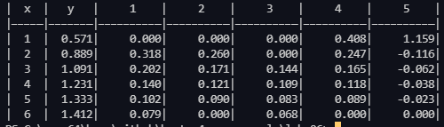

<script type="text/javascript" src="http://cdn.mathjax.org/mathjax/latest/MathJax.js?config=TeX-AMS-MML_HTMLorMML"></script>
<script type="text/x-mathjax-config"> MathJax.Hub.Config({ tex2jax: {inlineMath: [['$', '$']]}, messageStyle: "none" });</script>

## Цель работы

Получение навыков построения алгоритма вычисления производных от сеточных функций.

## Исходные данные

Задана табличная (сеточная) функция.

| x   | y     | 1   | 2   | 3   | 4   | 5   |
| --- | ----- | --- | --- | --- | --- | --- |
| 1   | 0.571 |     |     |     |     |     |
| 2   | 0.889 |     |     |     |     |     |
| 3   | 1.091 |     |     |     |     |     |
| 4   | 1.231 |     |     |     |     |     |
| 5   | 1.333 |     |     |     |     |     |
| 6   | 1.412 |     |     |     |     |     |

Вычислить первые разностные производные от функции и занести их в столбцы (1)-(4) таблицы:

* 1 - односторонняя разностная производная,
* 2 - центральная разностная производная,
* 3 - 2-я формула Рунге с использованием односторонней производной,
* 4 -  введены выравнивающие переменные.
* В столбец 5 занести вторую разностную производную.

## Код программы

```py
def output(x, y, y1, y2, y3, y4, y5):
    print("|  x  |   y   |     1    |     2    |     3    |     4    |     5    |")
    print("|—————|———————|——————————|——————————|——————————|——————————|——————————|")
    for i in range(6):
        print("|  {0}  |{1:7.3f}|{2:10.3f}|{3:10.3f}|{4:10.3f}|{5:10.3f}|{6:10.3f}|".format(
            x[i], y[i], y1[i], y2[i], y3[i], y4[i], y5[i]))


def left_dif(y, h):
    y1 = [0 for i in range(len(y))]
    for i in range(1, len(y)):
        y1[i] = (y[i] - y[i - 1]) / h

    return y1


def center_dif(y, h):
    y2 = [0 for i in range(len(y))]
    for i in range(1, len(y) - 1):
        y2[i] = (y[i + 1] - y[i - 1]) / 2 * h

    return y2


def second_runge_dif(y, y1, h, p):
    tmp = [0] * 2
    y3 = [0 for i in range(len(y))]

    for i in range(2, len(y)):
        tmp.append((y[i] - y[i - 2]) / (2 / h))

    for i in range(2, len(y1)):
        y3[i] = y1[i] + (y1[i] - tmp[i]) / (2**p - 1)

    return y3


def aligned_coeffs_dif(x, y):
    y4 = [0 for i in range(len(y))]
    for i in range(len(y) - 1):
        k = y[i]**2 / x[i] ** 2
        y4[i] = k * (-1 / y[i + 1] + 1/y[i]) / (-1/x[i + 1] + 1 / x[i])

    return y4


def second_left_dif(y, h):
    y5 = [0 for i in range(len(y))]
    for i in range(len(y) - 1):
        y5[i] = (y[i - 1] - 2 * y[i] + y[i + 1]) / h**2

    return y5


h = 1.0
x = [i for i in range(1, 7)]
y = [0.571, 0.889, 1.091, 1.231, 1.333, 1.412]

y1 = left_dif(y, h)
y2 = center_dif(y, h)
y3 = second_runge_dif(y, y1, h, 1)
y4 = aligned_coeffs_dif(x, y)
y5 = second_left_dif(y, h)

output(x, y, y1, y2, y3, y4, y5)

```

## Результат работы



* 1 – левосторонняя формула. Точностью $O(h)$
* 2 – центральная формула. Точностью $O(h^2)$
* 3 – вторая формула Рунге (с использованием левосторонней формулы)
* 4 — применение выравнивающих переменных (из-за того, что параметры неизвестны, оценка точности затруднительна). Было использовано соотношение

$$y^\prime_x = \frac{\eta^{\prime}_{\xi}y^2}{x^2}$$

* 5 — вторая разностная производная

## Вопросы при защите лабораторной работы

1. *Получить формулу порядка точности $O(h^2)$ для первой разностной производной $y^\prime_N$ в крайнем правом узле $x_N$*
   
$$y_{N-1} = y_N - hy^\prime_n + \frac{h^2}{2!}y^{\prime\prime}_N - \frac{h^3}{3!}y^{\prime\prime\prime}_N...$$


$$y_{N-2} = y_N - 2hy^\prime_n + \frac{4h^2}{2!}y^{\prime\prime}_N - \frac{8h^3}{3!}y^{\prime\prime\prime}_N...$$

$$y^\prime_N = \frac{3y_N - 4y_{N-1} + y_{N-2}}{2h} + \frac{h^2}{3}y^{\prime\prime\prime}_N$$

$$y^\prime_N = \frac{3y_N - 4y_{N-1} + y_{N-2}}{2h} + O(h^2)$$

2. *Получить формулу порядка точности O(h^2) для второй разностной производной $y^{\prime\prime}_0$ в крайнем левом узле $x_0$*
   
$$y_1 = y_0 + h^\prime_0 + \frac{h^2}{2!}y^{\prime\prime}_0 - \frac{h^3}{3!}y^{\prime\prime\prime}_0$$
$$y_2 = y_0 + 2h^\prime_0 + \frac{4h^2}{2!}y^{\prime\prime}_0 - \frac{8h^3}{3!}y^{\prime\prime\prime}_0$$

Домножим y1 на 4 и вычтем y2. Получим:

$$4y_1 - y_2 = 4y_0 - y_0 + 2hy^\prime_0 + O(h^2)$$
$$y^\prime_0 = \frac{-3y_0 + 4y_1 - y_2}{2h} + O(h^2)$$
$$y^{\prime\prime}_0 = \frac{-y_3 + 4y_2 - 5y_1 + 2y_0}{h^2} + O(h^2)$$

3. *Используя 2-ую формулу Рунге, дать вывод выражения (9) из Лекции №7 для первой производной $y^\prime_N$ в левом крайнем узле*


$$y^\prime_0 = \frac{-3y_0 + 4y_1 - y_2}{2h} + O(h^2)$$

$$\Omega = \Phi(h) + \frac{\Phi(h) - \Phi(mh)}{m^p - 1} + O(h^{p + 1}) = \frac{y_{n + 1}-y_n}{h} + \frac{\frac{y_{n+1}-y_n}{h} - \frac{y_{n+2}-y_n}{2h}}{2^1-1} + O(h^2) = \frac{-3y_n + 4y_{n+1}-y_{n+2}}{2h} + O(h^2)$$

Для левого узла $n = 0, n + 1 = 1, n + 2 = 2$, откуда $y^\prime_0 = \frac{-3y_0+4y_1-y_2}{2h} + O(h^2)$

4. *Любым способом из Лекций №7, 8 получить формулу порядка точности $O(h^3)$ для первой разностной производной $y^\prime_N$ в крайнем левом узле $x_0$*

$$y_1 = y_0 + h^\prime_0 + \frac{h^2}{2!}y^{\prime\prime}_0 - \frac{h^3}{3!}y^{\prime\prime\prime}_0$$
$$y_2 = y_0 + 2h^\prime_0 + \frac{4h^2}{2!}y^{\prime\prime}_0 - \frac{8h^3}{3!}y^{\prime\prime\prime}_0$$
$$y_3 = y_0 + 3h^\prime_0 + \frac{9h^2}{2!}y^{\prime\prime}_0 - \frac{27h^3}{3!}y^{\prime\prime\prime}_0$$
$$y^\prime = \frac{y_3+27y_1-28y_0}{30h} + O(h^3)$$